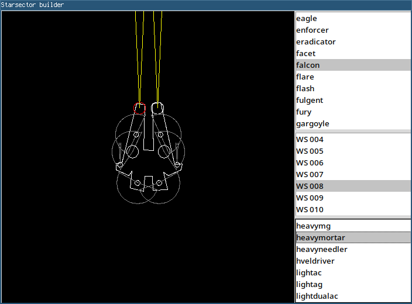

# Starsector builder
A tool to create and optimize starsector builds



# How to run
This tool requires python, with the `tk` library, and Starsector.

In this directory, you have to create links to the `data/hulls` and
`data/weapons` folders in your Starsector directory.

On Linux, you can use `create_links.sh` for that:

```
$ ./crate_links.sh <Starsector install directory>
```

Then, you can run the tool normally, with `python main.py` or just `./main.py`.

# Manual
WIP.

# Features
- [X] Ship and weapon selection
- [ ] Ordonance points
- [ ] Multiple targets
- [ ] Optimization
- [ ] Hullmods
- [ ] Fleets
- [ ] Inventory
